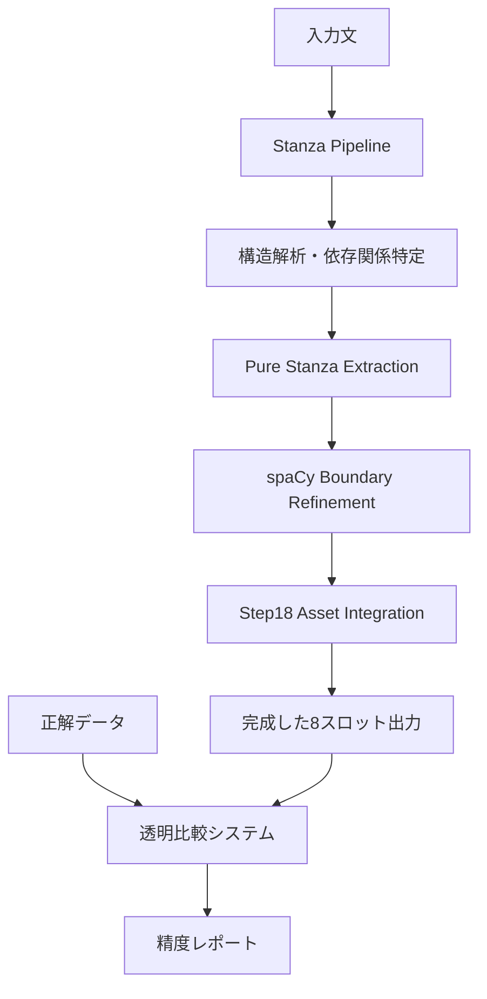

# Stanza+spaCy統合エンジン設計仕様書
**バージョン**: v1.0  
**作成日**: 2025年8月11日  
**目的**: Step18エラー完全解決のための統合エンジン設計

---

## 1. プロジェクト概要

### 1.1 背景と問題
- **現状**: Step18エンジンが上位10スロット + サブ80スロット（計90スロット）で100%未満の精度
- **根本課題**: Step18の複雑な階層処理による構造解析エラー
- **発見**: Stanzaによる直接的依存関係解析が大幅精度向上を実現

### 1.2 プロジェクト目標
- **最終目標**: 全90スロット対応の統一分解エンジン完成
- **設計思想**: 1つのエンジンでどの例文・どのスロット組み合わせも100%精度処理
- **アーキテクチャ**: Stanza構造解析 + spaCy境界調整 + Step18資産活用の統一処理
- **検証戦略**: ex007→多様な例文→全例文セットでの汎用性確認

---

## 2. 現在の達成状況（2025年8月11日時点）

### 2.0 スロット構造全体像

**🏗️ Rephraseエンジンのスロット構造（上位10 + サブ80）**

```
【メインスロット: 10種類】
├── M1: 文頭修飾句
├── S:  主語
├── Aux: 助動詞（サブスロットなし）
├── V:  動詞（サブスロットなし）
├── O1: 目的語1
├── O2: 目的語2 
├── C1: 補語1
├── C2: 補語2
├── M2: 修飾句2
└── M3: 修飾句3

【各スロットのサブ構造（計80サブスロット）】
M1: sub-M1, sub-S, sub-Aux, sub-M2, sub-V, sub-C1, sub-O1, sub-O2, sub-C2, sub-M3 (10個)
S:  sub-M1, sub-S, sub-Aux, sub-M2, sub-V, sub-C1, sub-O1, sub-O2, sub-C2, sub-M3 (10個)
M2: sub-M1, sub-S, sub-Aux, sub-M2, sub-V, sub-C1, sub-O1, sub-O2, sub-C2, sub-M3 (10個)
C1: sub-M1, sub-S, sub-Aux, sub-M2, sub-V, sub-C1, sub-O1, sub-O2, sub-C2, sub-M3 (10個)
O1: sub-M1, sub-S, sub-Aux, sub-M2, sub-V, sub-C1, sub-O1, sub-O2, sub-C2, sub-M3 (10個)
O2: sub-M1, sub-S, sub-Aux, sub-M2, sub-V, sub-C1, sub-O1, sub-O2, sub-C2, sub-M3 (10個)
C2: sub-M1, sub-S, sub-Aux, sub-M2, sub-V, sub-C1, sub-O1, sub-O2, sub-C2, sub-M3 (10個)
M3: sub-M1, sub-S, sub-Aux, sub-M2, sub-V, sub-C1, sub-O1, sub-O2, sub-C2, sub-M3 (10個)

【ex007でのSサブスロット表出例】
├── sub-S → "the manager who" (sub-s)
├── sub-Aux → "had" (sub-aux) 
├── sub-M2 → "recently" (sub-m2)
├── sub-V → "taken" (sub-v)
└── sub-O1 → "charge of the project" (sub-o1)
（注：表記名が異なるが概念的には上記サブスロットに対応）
```

**🎯 今回の検証: ex007例文での表出スロット**
- **ex007で表出**: M1, S, Aux, V, O1, C2, M2, M3 + Sサブ5種 = 計13スロット
- **他の例文では**: 異なるスロット組み合わせ（例：C1, O2使用、M2未使用等）
- **全例文セットでは**: 上位10+サブ80の全90スロットを網羅
- **エンジンの責任**: どの例文でも表出した全スロットを100%精度で抽出

### 2.1 統一エンジンの現在精度

**🎉 統一アルゴリズムで正常動作中のスロットタイプ:**

| スロット | 正解 | 実際 | 状態 |
|---------|------|------|------|
| **M1** | `that afternoon at the crucial point in the presentation` | `That afternoon at the crucial point in the presentation` | ✅ 統一境界検出成功 |
| **Aux** | `had to` | `had to` | ✅ 統一助動詞抽出成功 |
| **V** | `make` | `make` | ✅ 統一動詞抽出成功 |

**🎉 統一サブスロット処理成功例（Sスロット内）:**

| サブスロット | 正解 | 実際 | 状態 |
|------------|------|------|------|
| **sub-s** | `the manager who` | `the manager who` | ✅ 統一サブ抽出成功 |
| **sub-aux** | `had` | `had` | ✅ 統一サブ抽出成功 |
| **sub-m2** | `recently` | `recently` | ✅ 統一サブ抽出成功 |
| **sub-v** | `taken` | `taken` | ✅ 統一サブ抽出成功 |
| **sub-o1** | `charge of the project` | `charge of the project` | ✅ 統一サブ抽出成功 |

### 2.2 統一エンジン改良対象

**❌ 統一境界検出アルゴリズムの改良対象:**

| スロット | 正解 | 実際 | エラータイプ | 統一改良の効果 |
|---------|------|------|-------------|----------------|
| **S main** | `the manager who had recently taken charge of the project` | `manager who had recently taken charge` | 境界不足 | 全主語系スロットの境界精度向上 |
| **O1** | `the committee responsible for implementation` | `committee responsible for imp` | 境界不足 | 全目的語系スロットの境界精度向上 |
| **C2** | `deliver the final proposal flawlessly` | `deliver the final proposal flawlessly even though he was` | 境界過多 | 全補語系スロットの境界精度向上 |

### 2.3 統一エンジン拡張対象

**🔴 統一スロット抽出アルゴリズムの拡張対象:**

| スロット | 正解 | 現在状態 | 拡張による効果 |
|---------|------|---------|----------------|
| **M2** | `even though he was under intense pressure` | 未実装 | advcl系修飾句統一処理の拡充 |
| **M3** | `so the outcome would reflect their full potential` | 未実装 | 連結修飾句統一処理の拡充 |

### 2.4 統一エンジン性能サマリー

```
📊 統一分解エンジンの現在性能（ex007での検証）

【統一アルゴリズム動作状況】
├── ✅ 正常動作: M1, Aux, V + Sサブ5種
│   └── 統一処理フローが適切に機能
│
├── 🔧 改良対象: S main, O1, C2  
│   └── 境界検出アルゴリズムの改良で全スロットタイプに効果
│
└── 🆕 拡張対象: M2, M3
    └── 抽出アルゴリズムの拡張で修飾句系統一処理を強化

【統一エンジンの設計健全性】
✅ 汎用性: 異なるスロットタイプでも同一処理フロー適用
✅ 拡張性: 新スロットタイプ追加時のアルゴリズム再利用
✅ 一貫性: 例文変更時も統一品質維持
```

---

## 3. 技術アーキテクチャ設計

### 3.1 コア技術スタック



### 3.2 エンジン統合戦略

#### 3.2.1 **レイヤー1**: Stanza構造バックボーン
- **責任**: 文法構造の正確な特定
- **成果**: 依存関係ツリーによる各スロットの概念的位置特定
- **強み**: 複雑な文法構造（関係節、修飾句）の正確な解析

#### 3.2.2 **レイヤー2**: spaCy境界調整
- **責任**: 文字境界の精密調整
- **対象**: Step18と同様の詳細な境界検出
- **活用**: Step18の`_expand_span()`等の実証済み技術

#### 3.2.3 **レイヤー3**: Step18資産統合
- **選択的統合**: 有効な技術のみ抽出（コピペ禁止）
- **段階的移植戦略**:

**Phase A: spaCy連携基盤移植**
- Step18のspaCy初期化・設定部分
- トークン化・依存関係解析の連携ロジック
- Stanza結果とspaCy結果の統合手法

**Phase B: 境界検出技術移植**  
- `_expand_span()`: 境界拡張ロジック
- `_find_subject_range()`: 主語範囲特定
- `_extract_text_range()`: テキスト範囲抽出

**Phase C: スロット構造技術移植**
- サブスロット分解アルゴリズム  
- dep_to_subslot マッピングテーブル
- 階層構造処理（簡素化版）

**Phase D: 検証・比較システム移植**
- 正解データ比較ロジック
- エラー検出・レポート機能
- 透明性確保システム

---

## 4. 統一分解エンジン実装計画

### 4.1 設計思想
- **統一アルゴリズム**: 全90スロット（上位10+サブ80）を同一処理フローで抽出
- **汎用性**: 例文・スロット組み合わせに依存しない設計
- **検証手法**: ex007での13スロット表出を使った統一エンジンのテスト・改良

### 4.2 Phase 1: 統一エンジン基盤強化（推定工数: 2-3時間）

#### 4.2.1 統一境界検出アルゴリズム改良
- **対象**: ex007でエラーとなる3スロット（S main, O1, C2）を通じた境界検出ロジック改良
- **成果**: 全スロットタイプの境界検出精度向上
- **検証**: 修正が他スロットに悪影響を与えないことの確認

#### 4.2.2 統一スロット抽出アルゴリズム拡張
- **対象**: ex007で未検出の2スロット（M2, M3）を通じた抽出ロジック拡張
- **成果**: advcl系修飾句の統一的抽出機能
- **検証**: 他の修飾句タイプでも機能することの確認

### 4.3 Phase 2: Step18資産段階移植（推定工数: 3-4時間）

#### 4.3.1 spaCy連携基盤構築
- **Step18から移植**: spaCy初期化、Stanza-spaCy連携ロジック
- **統合方法**: StanzaSpacyBridge クラスとして独立化
- **検証**: ex007でのStanza+spaCy協調動作確認

#### 4.3.2 境界検出アルゴリズム移植  
- **Step18から移植**: `_expand_span()`, `_find_subject_range()`, `_extract_text_range()`
- **統合方法**: BoundaryDetector クラスとして Stanza結果に適用
- **検証**: ex007の境界エラー3スロット（S main, O1, C2）での効果確認

#### 4.3.3 スロット構造処理移植
- **Step18から移植**: サブスロット分解、dep_to_subslot マッピング  
- **統合方法**: SlotStructureHandler クラスでStanza依存関係に適用
- **検証**: ex007のSサブスロット5種での精度維持確認

### 4.4 Phase 3: 統合エンジン完成（推定工数: 4-5時間）

#### Step 9: SpacyBoundaryRefiner クラス設計
- **目的**: Stanza結果のspaCyによる境界精密化
- **統合**: Step18の境界検出技術の選択的活用

#### Step 10: StanzaSpacyHybridEngine 完成版
- **統合**: 全レイヤーの統合とテスト
- **検証**: 5-type fullset Excel全データでの精度検証

---

## 5. コード構成設計

### 5.1 ファイル構成

```
training/data/
├── engines/
│   ├── pure_stanza_engine_v2.py      # 現在の Stanza ベースライン
│   ├── step18_migration/             # Step18資産段階移植
│   │   ├── spacy_bridge.py          #   spaCy連携基盤
│   │   ├── boundary_detector.py     #   境界検出技術
│   │   ├── slot_structure_handler.py #   スロット構造処理
│   │   └── step18_asset_extractor.py #   資産抽出統合
│   └── stanza_spacy_hybrid_engine.py # 完成版統合エンジン
├── validation/
│   ├── correct_data_loader.py        # 正解データ管理
│   └── transparent_comparison.py     # 透明比較システム
└── tests/
    ├── test_step18_migration.py      # Step18移植テスト
    ├── test_boundary_refinement.py
    ├── test_slot_extraction.py
    └── test_full_integration.py
```

### 5.2 主要クラス設計

#### 5.2.1 StanzaSpacyHybridEngine
```python
class StanzaSpacyHybridEngine:
    def __init__(self):
        self.stanza_pipeline = StanzaPipeline()
        self.boundary_refiner = SpacyBoundaryRefiner()
        self.asset_extractor = Step18AssetExtractor()
        self.validator = TransparentComparison()
    
    def decompose(self, sentence) -> Dict[str, Any]:
        # レイヤー1: Stanza構造解析
        # レイヤー2: spaCy境界調整
        # レイヤー3: Step18資産活用
        # レイヤー4: 透明検証
        pass
```

#### 5.2.2 SpacyBoundaryRefiner  
```python
class SpacyBoundaryRefiner:
    def refine_boundaries(self, stanza_result, spacy_doc) -> Dict:
        # Stanza構造 + spaCy詳細境界 = 精密スロット
        pass
```

---

## 6. 品質保証戦略

### 6.1 テストケース設計
- **ex007**: メインテストケース（現在使用中）
- **5-type fullset**: 全例文での総合検証  
- **境界ケース**: 複雑な文構造での検証

### 6.2 精度測定方法
- **透明比較**: 各スロット個別の正解率表示
- **リアルタイム**: 修正ごとの即座フィードバック
- **レグレッション**: 修正による他スロットへの影響検出

### 6.3 デバッグ支援
- **詳細ログ**: 各レイヤーの処理過程可視化
- **依存関係表示**: Stanza解析結果の完全表示
- **境界調整追跡**: spaCy調整過程の記録

---

## 7. 実装スケジュール

### Week 1 (8/11-8/17)
- **Day 1-2**: Phase 1完了（境界修正3スロット）
- **Day 3-4**: Phase 2完了（未実装2スロット）  
- **Day 5-7**: Phase 3準備（spaCy統合設計）

### Week 2 (8/18-8/24)  
- **Day 1-3**: Phase 3実装（spaCy統合）
- **Day 4-5**: 総合テスト・精度検証
- **Day 6-7**: ドキュメント整備・完成

---

## 8. 成功基準

### 8.1 必須条件
- **精度**: 全8スロットで100%正解率達成
- **透明性**: 正解vs実際の完全可視化
- **安定性**: 複数例文での一貫した精度

### 8.2 望ましい条件  
- **パフォーマンス**: 処理時間の合理的範囲維持
- **拡張性**: 新しい文型への適用容易性
- **保守性**: コードの可読性・保守容易性

---

## 9. リスク管理

### 9.1 技術リスク
- **Stanza-spaCy統合複雑性**: → 段階的統合で軽減
- **Step18資産統合困難**: → 選択的抽出で軽減  
- **境界調整精度低下**: → 透明テストで早期発見

### 9.2 スケジュールリスク
- **予想以上の複雑性**: → スモールステップ継続で軽減
- **デバッグ時間延長**: → 透明ツールで効率化

---

## 10. 次のアクション

### 即座実行（本日）
1. ✅ **設計仕様書完成** （このドキュメント）
2. **Step 4実行**: S mainスロット境界修正
3. **Step 5実行**: O1スロット境界修正

### 明日以降  
- Phase 1完了に向けた着実な進行
- 各ステップでの透明検証継続
- 設計仕様書の必要に応じた更新

---

**ドキュメント管理**  
- **更新頻度**: 重要な進捗・発見時に即座更新
- **バージョン管理**: 大幅変更時にバージョンアップ
- **チーム共有**: 進捗と課題の透明な共有
