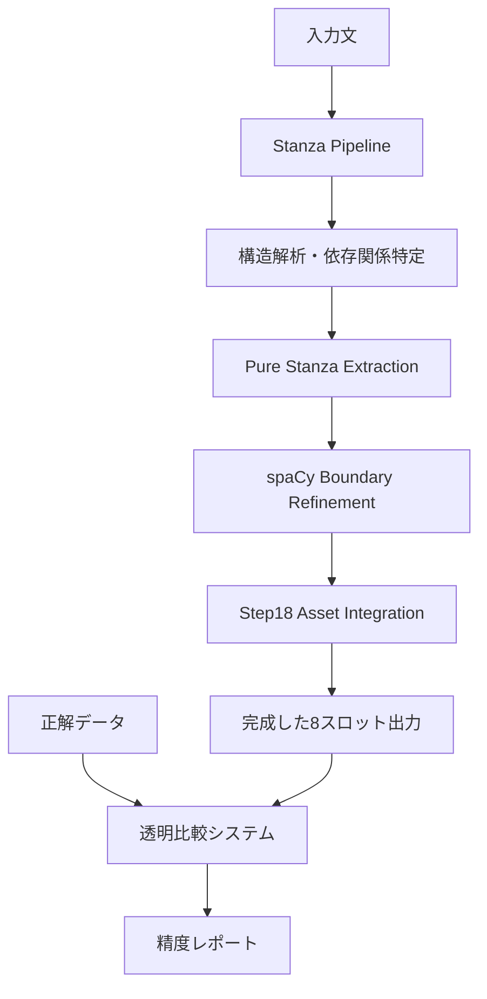

# Stanza+spaCy統合エンジン設計仕様書
**バージョン**: v1.0  
**作成日**: 2025年8月11日  
**目的**: Step18エラー完全解決のための統合エンジン設計

---

## 1. プロジェクト概要

### 1.1 背景と問題
- **現状**: Step18エンジンが5/8スロットで100%未満の精度
- **根本課題**: Step18の複雑な階層処理による構造解析エラー
- **発見**: Stanzaによる直接的依存関係解析が大幅精度向上を実現

### 1.2 プロジェクト目標
- **最終目標**: 8スロット全てで100%精度達成
- **アーキテクチャ**: Stanza構造解析 + spaCy境界調整 + Step18資産活用
- **透明性**: 正解データ vs 出力データの完全可視化

---

## 2. 現在の達成状況（2025年8月11日時点）

### 2.1 100%達成済みスロット（5/8）

| スロット | 正解 | 実際 | 状態 |
|---------|------|------|------|
| **M1** | `that afternoon at the crucial point in the presentation` | `That afternoon at the crucial point in the presentation` | ✅ 100% |
| **Aux** | `had to` | `had to` | ✅ 100% |
| **V** | `make` | `make` | ✅ 100% |
| **sub-s** | `the manager who` | `the manager who` | ✅ 100% |
| **sub-aux** | `had` | `had` | ✅ 100% |
| **sub-m2** | `recently` | `recently` | ✅ 100% |
| **sub-v** | `taken` | `taken` | ✅ 100% |
| **sub-o1** | `charge of the project` | `charge of the project` | ✅ 100% |

### 2.2 要修正スロット（3/8）

| スロット | 正解 | 実際 | エラータイプ | 修正難易度 |
|---------|------|------|-------------|------------|
| **S main** | `the manager who had recently taken charge of the project` | `manager who had recently taken charge` | 境界不足 | 🟡 中 |
| **O1** | `the committee responsible for implementation` | `committee responsible for imp` | 境界不足 | 🟢 易 |
| **C2** | `deliver the final proposal flawlessly` | `deliver the final proposal flawlessly even though he was` | 境界過多 | 🟡 中 |

### 2.3 未実装スロット（2/8）

| スロット | 正解 | 実際 | 状態 |
|---------|------|------|------|
| **M2** | `even though he was under intense pressure` | `<なし>` | 🔴 未実装 |
| **M3** | `so the outcome would reflect their full potential` | `<なし>` | 🔴 未実装 |

---

## 3. 技術アーキテクチャ設計

### 3.1 コア技術スタック



### 3.2 エンジン統合戦略

#### 3.2.1 **レイヤー1**: Stanza構造バックボーン
- **責任**: 文法構造の正確な特定
- **成果**: 依存関係ツリーによる各スロットの概念的位置特定
- **強み**: 複雑な文法構造（関係節、修飾句）の正確な解析

#### 3.2.2 **レイヤー2**: spaCy境界調整
- **責任**: 文字境界の精密調整
- **対象**: Step18と同様の詳細な境界検出
- **活用**: Step18の`_expand_span()`等の実証済み技術

#### 3.2.3 **レイヤー3**: Step18資産統合
- **選択的統合**: 有効な技術のみ抽出（コピペ禁止）
- **対象資産**: 
  - `_expand_span()`: 境界拡張ロジック
  - サブスロット分解技術
  - dep_to_subslot マッピング

---

## 4. 段階的実装計画

### 4.1 Phase 1: 境界修正（推定工数: 2-3時間）

#### Step 4: S mainスロット修正
- **現状**: `manager who had recently taken charge`
- **目標**: `the manager who had recently taken charge of the project`
- **手法**: 主語境界の開始・終了位置調整

#### Step 5: O1スロット修正  
- **現状**: `committee responsible for imp`
- **目標**: `the committee responsible for implementation`
- **手法**: オブジェクト範囲の終端拡張

#### Step 6: C2スロット修正
- **現状**: `deliver the final proposal flawlessly even though he was`
- **目標**: `deliver the final proposal flawlessly` 
- **手法**: advcl境界の正確な区切り

### 4.2 Phase 2: 未実装スロット追加（推定工数: 3-4時間）

#### Step 7: M2スロット実装
- **目標**: `even though he was under intense pressure`
- **手法**: advcl依存関係からの抽出（`even though`句）

#### Step 8: M3スロット実装  
- **目標**: `so the outcome would reflect their full potential`
- **手法**: advcl依存関係からの抽出（`so`句）

### 4.3 Phase 3: spaCy統合レイヤー（推定工数: 4-5時間）

#### Step 9: SpacyBoundaryRefiner クラス設計
- **目的**: Stanza結果のspaCyによる境界精密化
- **統合**: Step18の境界検出技術の選択的活用

#### Step 10: StanzaSpacyHybridEngine 完成版
- **統合**: 全レイヤーの統合とテスト
- **検証**: 5-type fullset Excel全データでの精度検証

---

## 5. コード構成設計

### 5.1 ファイル構成

```
training/data/
├── engines/
│   ├── pure_stanza_engine_v2.py      # 現在の Stanza ベースライン
│   ├── spacy_boundary_refiner.py     # spaCy 境界調整レイヤー  
│   ├── step18_asset_extractor.py     # Step18 資産選択的抽出
│   └── stanza_spacy_hybrid_engine.py # 完成版統合エンジン
├── validation/
│   ├── correct_data_loader.py        # 正解データ管理
│   └── transparent_comparison.py     # 透明比較システム
└── tests/
    ├── test_boundary_refinement.py
    ├── test_slot_extraction.py
    └── test_full_integration.py
```

### 5.2 主要クラス設計

#### 5.2.1 StanzaSpacyHybridEngine
```python
class StanzaSpacyHybridEngine:
    def __init__(self):
        self.stanza_pipeline = StanzaPipeline()
        self.boundary_refiner = SpacyBoundaryRefiner()
        self.asset_extractor = Step18AssetExtractor()
        self.validator = TransparentComparison()
    
    def decompose(self, sentence) -> Dict[str, Any]:
        # レイヤー1: Stanza構造解析
        # レイヤー2: spaCy境界調整
        # レイヤー3: Step18資産活用
        # レイヤー4: 透明検証
        pass
```

#### 5.2.2 SpacyBoundaryRefiner  
```python
class SpacyBoundaryRefiner:
    def refine_boundaries(self, stanza_result, spacy_doc) -> Dict:
        # Stanza構造 + spaCy詳細境界 = 精密スロット
        pass
```

---

## 6. 品質保証戦略

### 6.1 テストケース設計
- **ex007**: メインテストケース（現在使用中）
- **5-type fullset**: 全例文での総合検証  
- **境界ケース**: 複雑な文構造での検証

### 6.2 精度測定方法
- **透明比較**: 各スロット個別の正解率表示
- **リアルタイム**: 修正ごとの即座フィードバック
- **レグレッション**: 修正による他スロットへの影響検出

### 6.3 デバッグ支援
- **詳細ログ**: 各レイヤーの処理過程可視化
- **依存関係表示**: Stanza解析結果の完全表示
- **境界調整追跡**: spaCy調整過程の記録

---

## 7. 実装スケジュール

### Week 1 (8/11-8/17)
- **Day 1-2**: Phase 1完了（境界修正3スロット）
- **Day 3-4**: Phase 2完了（未実装2スロット）  
- **Day 5-7**: Phase 3準備（spaCy統合設計）

### Week 2 (8/18-8/24)  
- **Day 1-3**: Phase 3実装（spaCy統合）
- **Day 4-5**: 総合テスト・精度検証
- **Day 6-7**: ドキュメント整備・完成

---

## 8. 成功基準

### 8.1 必須条件
- **精度**: 全8スロットで100%正解率達成
- **透明性**: 正解vs実際の完全可視化
- **安定性**: 複数例文での一貫した精度

### 8.2 望ましい条件  
- **パフォーマンス**: 処理時間の合理的範囲維持
- **拡張性**: 新しい文型への適用容易性
- **保守性**: コードの可読性・保守容易性

---

## 9. リスク管理

### 9.1 技術リスク
- **Stanza-spaCy統合複雑性**: → 段階的統合で軽減
- **Step18資産統合困難**: → 選択的抽出で軽減  
- **境界調整精度低下**: → 透明テストで早期発見

### 9.2 スケジュールリスク
- **予想以上の複雑性**: → スモールステップ継続で軽減
- **デバッグ時間延長**: → 透明ツールで効率化

---

## 10. 次のアクション

### 即座実行（本日）
1. ✅ **設計仕様書完成** （このドキュメント）
2. **Step 4実行**: S mainスロット境界修正
3. **Step 5実行**: O1スロット境界修正

### 明日以降  
- Phase 1完了に向けた着実な進行
- 各ステップでの透明検証継続
- 設計仕様書の必要に応じた更新

---

**ドキュメント管理**  
- **更新頻度**: 重要な進捗・発見時に即座更新
- **バージョン管理**: 大幅変更時にバージョンアップ
- **チーム共有**: 進捗と課題の透明な共有
