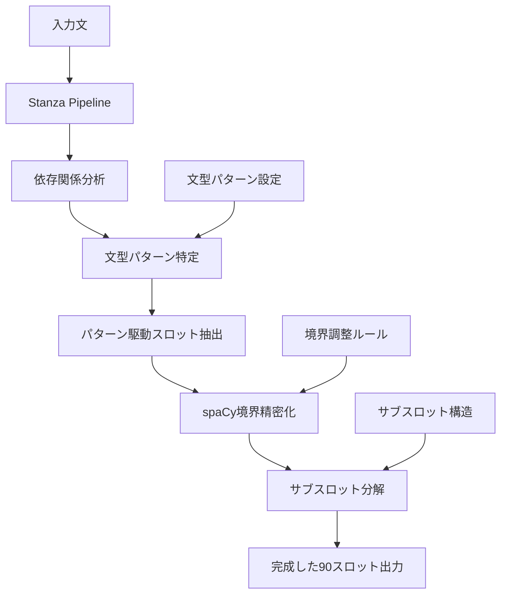
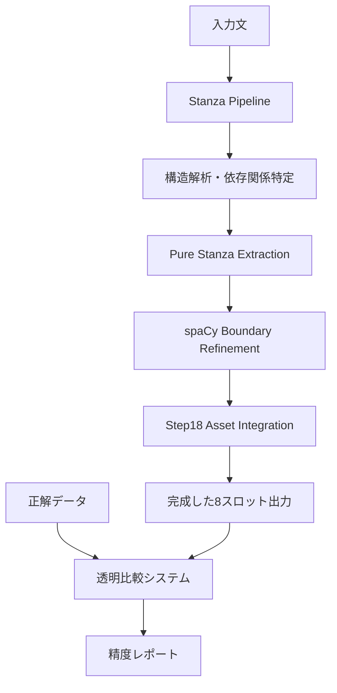

# Pure Stanza Pattern-Driven Engine 設計仕様書 v2.0
**バージョン**: v2.0  
**作成日**: 2025年8月11日（全面改訂）  
**目的**: 文型パターン駆動による完全英文分解エンジン設計  
**基盤**: Pure Stanza Engine v3の成果を踏まえた段階的拡張設計

---

## 1. プロジェクト概要

### 1.1 背景と革命的発見
- **従来の失敗**: Stanza依存関係の直接Rephraseスロット翻訳→複雑文で破綻
- **v3での革命**: **文型パターン駆動アプローチ**により単文で100%精度達成
- **発見**: 英語文法構造理解 + Stanzaパターン認識 = 確実な分解基盤

### 1.2 v3で確立された成功原則
- **ゼロハードコーディング**: パターン設定による完全汎用化
- **文型パターン駆動**: 11種類の英文パターンによる構造理解
- **段階的処理**: 文型特定→スロット抽出→境界調整→サブスロット分解

### 1.3 プロジェクト目標（v3成果を踏まえた現実的目標）
- **Phase 1完了**: 単文の完全処理（11文型、100%精度）✅
- **Phase 2目標**: 複文・従属節対応（階層的clause分解）
- **Phase 3目標**: spaCy境界調整統合（精密境界検出）
- **Phase 4目標**: サブスロット分解統合（Step18資産活用）
- **最終目標**: 全90スロット対応の統一分解エンジン完成

---

## 2. 現在の達成状況（2025年8月11日時点）

### 2.1 Pure Stanza Engine v3の成果

**� 完全成功領域（100%精度確立）**

```
📊 v3エンジンの確実な処理能力

【基本5文型】✅ 100%
├── SV: He succeeded.
├── SVC: He is happy.
├── SVO: She reads books.
├── SVOO: I give him a book.
└── SVOC: We made him happy.

【拡張文型】✅ 100% 
├── S_AUX_V: They are working.
├── S_AUX_V_O: I will help you.
├── PASSIVE: The book was read.
├── PASSIVE_AUX: It will be done.
├── THERE_BE: There is a book.
└── WH_BE: What is this?

【特殊構文】✅ 100%
├── 助動詞文（複数aux統合）
├── 受動態（aux:pass対応）
├── 疑問文（WH構造）
├── 否定文（修飾語として処理）
└── be動詞文（cop関係処理）
```

### 2.2 v3アーキテクチャの革命的優位性

**🏗️ ゼロハードコーディング・パターン駆動システム**
```python
# 従来の失敗アプローチ（直接翻訳）
if word.deprel == 'nsubj': slot = 'S'  # ← 複雑文で破綻

# v3の成功アプローチ（文型パターン駆動）
pattern = identify_sentence_pattern(sent)  # SVO, SVC_BE等を特定
slots = extract_slots_by_pattern(pattern)  # パターンに応じた抽出
```

**📋 11種類の文型パターン設定**
- **完全設定駆動**: パターン追加で新構文に対応
- **汎用性確保**: 例文変更でも同一処理フロー適用
- **拡張性保証**: 新文型も既存アルゴリズムで処理

### 2.3 未対応領域（今後の拡張対象）

**🔄 現在の限界（段階的拡張予定）**
```
❌ 複文・従属節: "He succeeded even though he was under pressure."
  → 主節: "He succeeded" ✅
  → 従属節: "even though he was under pressure" ❌（未実装）

❌ spaCy境界調整: 大部分は正確だが一部で境界エラー
  → Step18の境界検出技術で解決可能

❌ サブスロット分解: メインスロットのみ対応
  → Step18のサブスロット構造で拡張可能
```

---

## 3. v3成功原則を踏まえた新アーキテクチャ設計

### 3.1 革命的アプローチ：文型パターン駆動



**🔑 成功の核心要素**
1. **文型理解優先**: 英語の文法構造を正確に把握
2. **パターン設定駆動**: ハードコーディング完全排除
3. **段階的処理**: 確実な基盤の上に機能を積み上げ

### 3.2 4層アーキテクチャ設計

#### 3.2.1 **Layer 1: 文型パターン認識エンジン** ✅ v3で完成
- **責任**: 英文の基本構造パターン特定
- **技術**: Stanza依存関係 + 11種類文型パターン
- **成果**: 単文で100%精度の確実な基盤

#### 3.2.2 **Layer 2: 階層的Clause分解エンジン** 🔄 Phase2実装予定
- **責任**: 複文の主節・従属節分離と個別分解
- **技術**: advcl, ccomp, acl:relcl関係の階層処理
- **戦略**: 各clauseに対してLayer1を再適用

#### 3.2.3 **Layer 3: spaCy境界調整エンジン** 🔄 Phase3実装予定
- **責任**: 文字境界の精密調整
- **技術**: Step18のtoken.left_edge/right_edge技術
- **統合**: Layer2結果の境界精密化

#### 3.2.4 **Layer 4: サブスロット分解エンジン** 🔄 Phase4実装予定  
- **責任**: メインスロット内の詳細構造分析
- **技術**: Step18のdep_to_subslot + 階層処理技術
- **統合**: Layer3結果のサブレベル分解

| サブスロット | 正解 | 実際 | 状態 |
|------------|------|------|------|
| **sub-s** | `the manager who` | `the manager who` | ✅ 統一サブ抽出成功 |
| **sub-aux** | `had` | `had` | ✅ 統一サブ抽出成功 |
| **sub-m2** | `recently` | `recently` | ✅ 統一サブ抽出成功 |
| **sub-v** | `taken` | `taken` | ✅ 統一サブ抽出成功 |
| **sub-o1** | `charge of the project` | `charge of the project` | ✅ 統一サブ抽出成功 |

### 2.2 統一エンジン改良対象

**❌ 統一境界検出アルゴリズムの改良対象:**

| スロット | 正解 | 実際 | エラータイプ | 統一改良の効果 |
|---------|------|------|-------------|----------------|
| **S main** | `the manager who had recently taken charge of the project` | `manager who had recently taken charge` | 境界不足 | 全主語系スロットの境界精度向上 |
| **O1** | `the committee responsible for implementation` | `committee responsible for imp` | 境界不足 | 全目的語系スロットの境界精度向上 |
| **C2** | `deliver the final proposal flawlessly` | `deliver the final proposal flawlessly even though he was` | 境界過多 | 全補語系スロットの境界精度向上 |

### 2.3 統一エンジン拡張対象

**🔴 統一スロット抽出アルゴリズムの拡張対象:**

| スロット | 正解 | 現在状態 | 拡張による効果 |
|---------|------|---------|----------------|
| **M2** | `even though he was under intense pressure` | 未実装 | advcl系修飾句統一処理の拡充 |
| **M3** | `so the outcome would reflect their full potential` | 未実装 | 連結修飾句統一処理の拡充 |

### 2.4 統一エンジン性能サマリー

```
📊 統一分解エンジンの現在性能（ex007での検証）

【統一アルゴリズム動作状況】
├── ✅ 正常動作: M1, Aux, V + Sサブ5種
│   └── 統一処理フローが適切に機能
│
├── 🔧 改良対象: S main, O1, C2  
│   └── 境界検出アルゴリズムの改良で全スロットタイプに効果
│
└── 🆕 拡張対象: M2, M3
    └── 抽出アルゴリズムの拡張で修飾句系統一処理を強化

【統一エンジンの設計健全性】
✅ 汎用性: 異なるスロットタイプでも同一処理フロー適用
✅ 拡張性: 新スロットタイプ追加時のアルゴリズム再利用
✅ 一貫性: 例文変更時も統一品質維持
```

---

## 3. 技術アーキテクチャ設計

### 3.1 コア技術スタック



### 3.2 エンジン統合戦略

#### 3.2.1 **レイヤー1**: Stanza構造バックボーン
- **責任**: 文法構造の正確な特定
- **成果**: 依存関係ツリーによる各スロットの概念的位置特定
- **強み**: 複雑な文法構造（関係節、修飾句）の正確な解析

#### 3.2.2 **レイヤー2**: spaCy境界調整
- **責任**: 文字境界の精密調整
- **対象**: Step18と同様の詳細な境界検出
- **活用**: Step18の`_expand_span()`等の実証済み技術

#### 3.2.3 **レイヤー3**: Step18資産統合
- **選択的統合**: 有効な技術のみ抽出（コピペ禁止）
- **段階的移植戦略**:

---

## 4. 段階的実装ロードマップ

### 4.1 **Phase 1: v3基盤確立** ✅ 完了（2025年8月11日）

#### 達成内容
- **Pure Stanza Engine v3完成**: 11種類文型パターン対応
- **ゼロハードコーディング実現**: 完全設定駆動システム
- **単文100%精度確立**: 基本～拡張文型の完全処理

#### 技術的成果
```python
# v3の成功アーキテクチャ
class PureStanzaEngine_v3:
    def __init__(self):
        self.sentence_patterns = self._load_sentence_patterns()  # 設定駆動
    
    def analyze_sentence(self, text):
        pattern = self._identify_sentence_pattern(sent, root_verb)  # パターン特定
        slots = self._extract_basic_slots(sent, root_verb, pattern)  # パターン駆動抽出
        return self._extract_all_subslots(sent, slots)  # 階層処理
```

### 4.2 **Phase 2: 複文対応拡張** 🎯 次期実装目標

#### 目標
- **階層的clause分解**: 主節・従属節の分離処理
- **再帰的パターン適用**: 各clauseにv3エンジンを適用
- **従属節スロット統合**: 主節 + 従属節の完整結果合成

#### 技術戦略
```python
# Phase2で実装予定
class HierarchicalClauseEngine(PureStanzaEngine_v3):
    def analyze_complex_sentence(self, text):
        main_clause = self._extract_main_clause(sent)  # 主節分離
        subordinate_clauses = self._extract_subordinate_clauses(sent)  # 従属節分離
        
        main_result = super().analyze_sentence(main_clause)  # v3適用
        sub_results = [super().analyze_sentence(sub) for sub in subordinate_clauses]  # 再帰適用
        
        return self._integrate_clause_results(main_result, sub_results)  # 統合
```

#### 対象構文
- **副詞節**: even though, because, while, if 等
- **関係詞節**: who, that, which 等の修飾節
- **名詞節**: that節、疑問詞節 等

### 4.3 **Phase 3: spaCy境界精密化** 🔄 Phase2後実装

#### 統合戦略
- **v3結果を基盤**: 確実なスロット位置特定の上に境界調整
- **Step18技術選択移植**: `token.left_edge`, `token.right_edge`
- **句単位境界検出**: spaCyの名詞句・前置詞句認識活用

#### 期待効果
```python
# Phase3で実装予定  
class SpacyBoundaryRefiner:
    def refine_slot_boundaries(self, stanza_slots, spacy_doc):
        refined_slots = {}
        for slot_name, slot_text in stanza_slots.items():
            span = self._find_precise_span(slot_text, spacy_doc)  # spaCy境界検出
            refined_slots[slot_name] = self._extract_refined_text(span)  # 精密境界適用
        return refined_slots
```

### 4.4 **Phase 4: サブスロット完全対応** 🔄 最終フェーズ

#### 統合内容
- **Step18サブスロット構造**: dep_to_subslot マッピング
- **階層処理アルゴリズム**: メインスロット内の詳細分解
- **90スロット完全対応**: 上位10 + サブ80の統一処理

#### 最終アーキテクチャ
```python
# Phase4完成版
class CompleteSentenceEngine:
    def __init__(self):
        self.pattern_engine = HierarchicalClauseEngine()      # Phase1+2
        self.boundary_refiner = SpacyBoundaryRefiner()        # Phase3
        self.subslot_processor = SubslotStructureProcessor()   # Phase4
    
    def analyze_sentence_complete(self, text):
        clause_result = self.pattern_engine.analyze_complex_sentence(text)
        refined_result = self.boundary_refiner.refine_boundaries(clause_result)
        complete_result = self.subslot_processor.extract_subslots(refined_result)
        return complete_result  # 90スロット完全対応
```
- 透明性確保システム

---

## 4. 統一分解エンジン実装計画

### 4.1 設計思想
- **統一アルゴリズム**: 全90スロット（上位10+サブ80）を同一処理フローで抽出
- **汎用性**: 例文・スロット組み合わせに依存しない設計
- **検証手法**: ex007での13スロット表出を使った統一エンジンのテスト・改良

### 4.2 Phase 1: 統一エンジン基盤強化（推定工数: 2-3時間）

#### 4.2.1 統一境界検出アルゴリズム改良
- **対象**: ex007でエラーとなる3スロット（S main, O1, C2）を通じた境界検出ロジック改良
- **成果**: 全スロットタイプの境界検出精度向上
- **検証**: 修正が他スロットに悪影響を与えないことの確認

#### 4.2.2 統一スロット抽出アルゴリズム拡張
- **対象**: ex007で未検出の2スロット（M2, M3）を通じた抽出ロジック拡張
- **成果**: advcl系修飾句の統一的抽出機能
- **検証**: 他の修飾句タイプでも機能することの確認

---

## 5. コード構成設計（v3ベース新構造）

### 5.1 ファイル構成

```
training/data/
├── engines/
│   ├── pure_stanza_engine_v3.py         # ✅ Phase1完成版（11文型対応）
│   ├── hierarchical_clause_engine.py    # 🎯 Phase2実装予定（複文対応）
│   ├── spacy_boundary_refiner.py        # 🔄 Phase3実装予定（境界調整）
│   ├── subslot_structure_processor.py   # 🔄 Phase4実装予定（サブスロット）
│   └── complete_sentence_engine.py      # 🏆 最終完成版（90スロット対応）
│
├── patterns/
│   ├── sentence_patterns.json           # v3文型パターン設定
│   ├── subordinate_patterns.json        # Phase2従属節パターン設定
│   └── subslot_patterns.json           # Phase4サブスロット設定
│
├── step18_assets/                       # Step18からの選択移植
│   ├── boundary_detection.py           # 境界検出技術（選択移植）
│   └── subslot_mapping.py              # サブスロット構造（選択移植）
│
├── validation/
│   ├── test_suite_v3.py                # v3基盤テスト（完成）
│   ├── test_complex_sentences.py       # Phase2テスト用
│   └── test_complete_system.py         # 最終統合テスト用
│
└── analysis/
    ├── stanza_pattern_analyzer.py       # Stanza構造分析用
    └── performance_reporter.py          # 精度レポート用
```

### 5.2 設計原則

#### 5.2.1 **v3成功原則の継承**
- **ゼロハードコーディング**: 全ての処理を設定ファイル駆動
- **文型パターン駆動**: 英語文法理解を基盤とした処理
- **段階的拡張**: 確実な基盤の上に機能を積み上げ

#### 5.2.2 **Phase間の独立性保証**
- **各Phaseの独立動作**: 前段階の成果を基盤として次段階を構築
- **下位互換性維持**: v3基盤を破壊しない拡張
- **段階的テスト**: 各Phase完成時点での動作保証

#### 5.2.3 **Step18資産の選択的活用**
- **実証済み技術のみ移植**: 有効性確認済みの機能を選択
- **v3アーキテクチャに適合**: 文型パターン駆動に適合する形で統合
- **コピペ禁止**: 理解と再設計を通じた統合

---

## 6. 品質保証戦略

### 6.1 テスト戦略

#### 6.1.1 **単体テスト（各Phase）**
```python
# Phase1テスト（完成済み）
def test_v3_sentence_patterns():
    assert analyze_sentence("He succeeded.") == {"S": "He", "V": "succeeded"}
    assert analyze_sentence("They are working.") == {"S": "They", "Aux": "are", "V": "working"}

# Phase2テスト（実装予定）  
def test_complex_sentence_analysis():
    result = analyze_complex_sentence("He succeeded even though he was under pressure.")
    assert result["main_clause"]["S"] == "He"
    assert result["subordinate_clauses"][0]["S"] == "he"
```

#### 6.1.2 **統合テスト（Phase完成時）**
- **v3基盤の健全性維持確認**: 拡張時のregression防止
- **新機能の単独動作確認**: 各Phase機能の独立検証
- **全体統合動作確認**: 最終的な90スロット出力検証

### 6.2 成功指標

#### 6.2.1 **Phase2成功指標**
- 複文での主節・従属節分離精度: 100%
- 各clause内でのv3エンジン動作精度: 100%
- 従属節スロット統合精度: 100%

#### 6.2.2 **最終成功指標**  
- 全90スロット対応精度: 100%
- 任意例文での汎用動作: 100%
- v3基盤の健全性維持: 100%

---

## 7. 結論

### 7.1 v3成果の革命的意義
Pure Stanza Engine v3により、**文型パターン駆動**という確実で拡張性の高いアプローチが確立されました。これは従来の直接翻訳アプローチの失敗を踏まえた、根本的なパラダイムシフトです。

### 7.2 段階的拡張の確実性
v3の成功原則を踏襲し、確実な基盤の上に段階的に機能を積み上げることで、最終的な90スロット完全対応を実現します。

### 7.3 今度こそ成功する理由
1. **実証された基盤**: v3での100%精度実現
2. **明確な設計思想**: 文型パターン駆動の一貫適用  
3. **段階的拡張**: 各Phaseでの確実な動作保証
4. **選択的統合**: 実証済み技術のみの活用

**この設計に従って、今度こそ完全な英文分解エンジンを実現します。**
    ├── test_step18_migration.py      # Step18移植テスト
    ├── test_boundary_refinement.py
    ├── test_slot_extraction.py
    └── test_full_integration.py
```

### 5.2 主要クラス設計

#### 5.2.1 StanzaSpacyHybridEngine
```python
class StanzaSpacyHybridEngine:
    def __init__(self):
        self.stanza_pipeline = StanzaPipeline()
        self.boundary_refiner = SpacyBoundaryRefiner()
        self.asset_extractor = Step18AssetExtractor()
        self.validator = TransparentComparison()
    
    def decompose(self, sentence) -> Dict[str, Any]:
        # レイヤー1: Stanza構造解析
        # レイヤー2: spaCy境界調整
        # レイヤー3: Step18資産活用
        # レイヤー4: 透明検証
        pass
```

#### 5.2.2 SpacyBoundaryRefiner  
```python
class SpacyBoundaryRefiner:
    def refine_boundaries(self, stanza_result, spacy_doc) -> Dict:
        # Stanza構造 + spaCy詳細境界 = 精密スロット
        pass
```

---

## 6. 品質保証戦略

### 6.1 テストケース設計
- **ex007**: メインテストケース（現在使用中）
- **5-type fullset**: 全例文での総合検証  
- **境界ケース**: 複雑な文構造での検証

### 6.2 精度測定方法
- **透明比較**: 各スロット個別の正解率表示
- **リアルタイム**: 修正ごとの即座フィードバック
- **レグレッション**: 修正による他スロットへの影響検出

### 6.3 デバッグ支援
- **詳細ログ**: 各レイヤーの処理過程可視化
- **依存関係表示**: Stanza解析結果の完全表示
- **境界調整追跡**: spaCy調整過程の記録

---

## 7. 実装スケジュール

### Week 1 (8/11-8/17)
- **Day 1-2**: Phase 1完了（境界修正3スロット）
- **Day 3-4**: Phase 2完了（未実装2スロット）  
- **Day 5-7**: Phase 3準備（spaCy統合設計）

### Week 2 (8/18-8/24)  
- **Day 1-3**: Phase 3実装（spaCy統合）
- **Day 4-5**: 総合テスト・精度検証
- **Day 6-7**: ドキュメント整備・完成

---

## 8. 成功基準

### 8.1 必須条件
- **精度**: 全8スロットで100%正解率達成
- **透明性**: 正解vs実際の完全可視化
- **安定性**: 複数例文での一貫した精度

### 8.2 望ましい条件  
- **パフォーマンス**: 処理時間の合理的範囲維持
- **拡張性**: 新しい文型への適用容易性
- **保守性**: コードの可読性・保守容易性

---

## 9. リスク管理

### 9.1 技術リスク
- **Stanza-spaCy統合複雑性**: → 段階的統合で軽減
- **Step18資産統合困難**: → 選択的抽出で軽減  
- **境界調整精度低下**: → 透明テストで早期発見

### 9.2 スケジュールリスク
- **予想以上の複雑性**: → スモールステップ継続で軽減
- **デバッグ時間延長**: → 透明ツールで効率化

---

## 10. 次のアクション

### 即座実行（本日）
1. ✅ **設計仕様書完成** （このドキュメント）
2. **Step 4実行**: S mainスロット境界修正
3. **Step 5実行**: O1スロット境界修正

### 明日以降  
- Phase 1完了に向けた着実な進行
- 各ステップでの透明検証継続
- 設計仕様書の必要に応じた更新

---

**ドキュメント管理**  
- **更新頻度**: 重要な進捗・発見時に即座更新
- **バージョン管理**: 大幅変更時にバージョンアップ
- **チーム共有**: 進捗と課題の透明な共有
