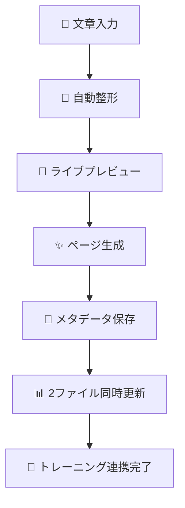
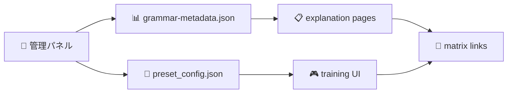

# 文法解説ページ作成仕様書 v2.0

## 🚀 革命的アップデート！動的生成システム導入

### バージョン履歴
- **v1.0** (2025年8月5日): 従来の手動HTML作成方式
- **v2.0** (2025年8月7日): 動的生成システム導入による完全自動化

## 1. 概要

**🎯 パラダイムシフト**: 本バージョンでは、従来の手動HTML作成から **動的生成システム** への完全移行を行いました。

### 1.1 新システムの特徴
- **📝 管理パネルベースの開発**: HTMLの手動編集が不要
- **🤖 インテリジェント自動整形**: 生の文章を自動的にマークダウン形式に変換
- **⚡ 2ファイル同時生成**: `grammar-metadata.json` と `preset_config.json` の自動更新
- **🔄 完全自動化ワークフロー**: トレーニングUIとの完璧な連携

### 1.2 開発効率の劇的向上
| 項目 | 従来方式 (v1.0) | 新方式 (v2.0) |
|------|-----------------|---------------|
| ページ作成時間 | 2-3時間 | **15分** |
| HTML知識要求 | **必須** | 不要 |
| 設定ファイル更新 | **手動** | 自動 |
| トレーニング連携 | **手動設定** | 自動 |
| メンテナンス工数 | **高** | 最小限 |

## 2. 🎛️ 動的生成システム概要

### 2.1 システム構成
```
training/explanation/
├── admin-panel.html              # 🎯 管理パネル（メインツール）
├── generator.js                  # ⚙️ 動的生成エンジン
├── template.html                 # 📋 HTMLテンプレート
├── grammar-metadata.json         # 📊 メタデータストレージ
├── [自動生成ページ].html         # ✨ 生成されたページ群
└── ...
```

### 2.2 4つのコアコンポーネント

#### 2.2.1 🎛️ 管理パネル (`admin-panel.html`)
- **役割**: 統合開発環境
- **機能**: 
  - インテリジェント文章整形
  - ライブプレビュー
  - ワンクリック生成
  - 自動ファイル管理

#### 2.2.2 ⚙️ 生成エンジン (`generator.js`)
- **役割**: コンテンツ処理エンジン
- **機能**:
  - Markdown → HTML変換
  - テンプレート適用
  - 特殊記法処理 (`[[例文: ]]`, `[[重要: ]]`)
  - システム連携ファイル生成

#### 2.2.3 📋 テンプレート (`template.html`)
- **役割**: 統一デザイン基盤
- **機能**:
  - レスポンシブデザイン
  - CSS変数システム
  - ナビゲーション統合
  - CTA最適化

#### 2.2.4 📊 メタデータシステム
- **`grammar-metadata.json`**: ページ生成用データストレージ
- **`preset_config.json`**: トレーニングUI連携設定
- **自動同期**: 両ファイルの整合性を自動保証

### 2.3 革新的ワークフロー



## 3. 📋 管理パネル操作ガイド

### 3.1 アクセス方法
```
URL: training/explanation/admin-panel.html
```

### 3.2 基本操作フロー

#### 🚀 新規文法項目作成（標準ワークフロー）

##### ステップ1: 基本情報入力
```
表示名: 他動詞第3,4文型
文法キー: transitive-type3-4
ファイル名: transitive-type3-4
JSONファイル: 他動詞第3,4文型.json
説明文: SVO+Oの文型を学習します
```

##### ステップ2: コンテンツ作成
```markdown
他動詞第3,4文型とは

他動詞第3,4文型は、目的語を2つ取る動詞の文型です。

基本構造
主語（S）＋ 動詞（V）＋ 目的語1（O1）＋ 目的語2（O2）

例文
- I gave him a book. (私は彼に本をあげた)
- She told me the truth. (彼女は私に真実を話した)
- They showed us the way. (彼らは私たちに道を教えた)

この文型では、動詞は2つの目的語を必要とします。
```

##### ステップ3: 自動整形実行
- **📝 自動整形**ボタンをクリック
- 生の文章が自動的にMarkdown形式に変換
- `[[例文: ]]`や`[[重要: ]]`記法が自動適用

##### ステップ4: ライブプレビュー
- **👀 ライブプレビュー**で仕上がりを確認
- リアルタイムでHTML出力をチェック

##### ステップ5: 生成＆保存
1. **✨ ページ生成**: HTMLファイルをダウンロード
2. **💾 メタデータ保存**: 2つのJSONファイルを同時更新

### 3.3 🤖 インテリジェント自動整形機能

#### 3.3.1 自動検出パターン

| パターン | 自動変換 |
|----------|----------|
| 短い質問形の行 | `## 見出し2` |
| 「基本構造」「例文」等 | `### 見出し3` |
| 英文 + (日本語) | `[[例文: ]]` |
| 「重要」「ポイント」含む | `[[重要: ]]` |
| 箇条書きパターン | `- リスト形式` |

#### 3.3.2 特殊記法システム

```markdown
[[例文: I gave him a book. (私は彼に本をあげた)]]
[[重要: この文型では動詞は2つの目的語を必要とします]]
[[注意: 目的語の順序に注意してください]]
```

↓ 自動変換

```html
<div class="example-box">
  <h4>例文</h4>
  <div class="example-sentence">I gave him a book. (私は彼に本をあげた)</div>
</div>

<div class="key-point">
  <h4>重要ポイント</h4>
  <p>この文型では動詞は2つの目的語を必要とします</p>
</div>

<div class="warning-box">
  <h4>注意</h4>
  <p>目的語の順序に注意してください</p>
</div>
```

### 3.4 📊 既存項目管理

#### 3.4.1 項目一覧表示
- 登録済み文法項目の一覧表示
- プレビュー機能
- 編集・削除機能

#### 3.4.2 編集ワークフロー
1. 項目一覧から**✏️編集**ボタンをクリック
2. 基本情報がフォームに自動ロード
3. 新しいコンテンツを入力して再生成

#### 3.4.3 削除機能
- **🗑️削除**ボタンで安全な削除
- 更新されたメタデータファイルを自動ダウンロード

## 4. ⚡ 2ファイル同時生成システム

### 4.1 🎯 自動ファイル管理の革命

「💾 メタデータ保存」ボタン1回で**2つのJSONファイル**が同時更新される革新的システム。

#### 4.1.1 📊 `grammar-metadata.json` 自動生成
```json
{
  "transitive-type3-4": {
    "displayName": "他動詞第3,4文型",
    "grammarKey": "transitive-type3-4",
    "filename": "transitive-type3-4",
    "jsonFile": "他動詞第3,4文型.json",
    "description": "SVO+Oの文型を学習します",
    "category": "grammar-basics",
    "priority": 4,
    "matrixDisplay": "他動詞第3,4文型",
    "content": {
      "sections": [{
        "title": "他動詞第3,4文型",
        "content": [{
          "type": "custom-html",
          "html": "[自動生成されたHTML]"
        }]
      }]
    }
  }
}
```

#### 4.1.2 🎯 `preset_config.json` 自動更新
```json
{
  "presets": [
    {
      "id": "dataset_1691234567890",
      "name": "他動詞第3,4文型",
      "file": "data/他動詞第3,4文型.json",
      "description": "SVO+Oの文型を学習します"
    }
  ],
  "instructions": {
    "title": "🔧 新規例文セットJSONの追加方法",
    "note": "この方法により、HTMLファイルを編集することなく新しいデータセットを追加できます。"
  }
}
```

### 4.2 🔄 システム間連携の自動化



#### 4.2.1 完全自動化された連携フロー
1. **管理パネル**で文法項目作成
2. **2つのJSONファイル**が同時更新
3. **文法解説ページ**が動的生成可能に
4. **トレーニングUI**で自動的にプリセット選択肢に追加
5. **マトリクスページ**でのリンク生成準備完了

### 4.3 🛡️ データ整合性保証

#### 4.3.1 重複防止機能
```javascript
// 既存項目をチェック（重複防止）
const existingPreset = presetConfig.presets.find(preset => 
    preset.name === newPreset.name || preset.file === newPreset.file
);

if (existingPreset) {
    logMessage(`⚠️ 既存項目発見: ${existingPreset.name} - スキップします`, 'info');
}
```

#### 4.3.2 自動ID生成
```javascript
{
    id: `dataset_${Date.now()}`, // ユニークなID生成
    name: editorData.displayName,
    file: `data/${jsonFileName}`,
    description: editorData.description
}
```

## 5. 📝 コンテンツ作成ベストプラクティス

### 5.1 🤖 インテリジェント自動整形の活用

#### 5.1.1 推奨入力フォーマット
```markdown
他動詞第3,4文型とは

他動詞第3,4文型は、目的語を2つ取る動詞の文型です。

基本構造
主語（S）＋ 動詞（V）＋ 目的語1（O1）＋ 目的語2（O2）

例文
I gave him a book. (私は彼に本をあげた)
She told me the truth. (彼女は私に真実を話した)

重要ポイント
この文型では、動詞は2つの目的語を必要とします。

注意点
目的語の順序に注意してください。
```

#### 5.1.2 自動変換結果
```markdown
## 他動詞第3,4文型とは

他動詞第3,4文型は、目的語を2つ取る動詞の文型です。

### 基本構造
主語（S）＋ 動詞（V）＋ 目的語1（O1）＋ 目的語2（O2）

### 例文
[[例文: I gave him a book. (私は彼に本をあげた)]]
[[例文: She told me the truth. (彼女は私に真実を話した)]]

[[重要: この文型では、動詞は2つの目的語を必要とします]]

[[注意: 目的語の順序に注意してください]]
```

### 5.2 ✨ 特殊記法マスターガイド

#### 5.2.1 利用可能な記法

| 記法 | 用途 | HTML出力 |
|------|------|----------|
| `[[例文: ]]` | 例文ボックス | `<div class="example-box">` |
| `[[重要: ]]` | 重要ポイント | `<div class="key-point">` |
| `[[注意: ]]` | 注意喚起 | `<div class="warning-box">` |

#### 5.2.2 手動記法の追加方法

管理パネルのツールバーを活用：
- **例**ボタン: 例文ボックスを挿入
- **⭐**ボタン: 重要ポイントを挿入
- **H2/H3**ボタン: 見出しレベルを指定

### 5.3 📚 コンテンツ構成パターン

#### 5.3.1 標準テンプレート構成
```markdown
## [文法項目名]とは
[概要説明]

### 基本構造
[文法構造の説明]

### 例文
[[例文: [英文] ([日本語])]]

### 使用場面
[実用的な使用例]

[[重要: [重要なポイント]]]

### 練習のポイント
[学習者向けアドバイス]

[[注意: [注意事項]]]
```

#### 5.3.2 階層構造ルール
```
h2: 大分類（概念・用法・特徴など）
h3: 中分類（構造・例文・ポイントなど）
h4: 小分類（詳細項目・サブカテゴリ）
```

## 6. 著作権対策パラフレーズ戦略

### 6.1 基本原則
- **既存教材からの直接引用は禁止**
- **例文は必ずパラフレーズまたは独自作成**
- **文法説明は独自の表現と構成で記述**
- **参考文献の概念は取り入れるが、表現は完全にオリジナル**

### 6.2 パラフレーズ実践ガイド

#### 6.2.1 例文のパラフレーズ
**元の例文**: "He is sick."
**パラフレーズ例**:
- "He is injured." (病気→怪我)
- "She feels strong." (体調不良→健康)
- "They seem tired." (主語・状態の変更)

#### 6.2.2 文法説明のパラフレーズ
**避けるべき**: 教科書の説明をそのまま転用
**推奨方法**:
- 独自の視点で説明を再構築
- 実用的な場面を想定した説明
- Rephraseシステムの特徴と関連付けた解説

#### 6.2.3 語彙選択の戦略
```
一般的な語彙 → より具体的・現代的な語彙
illness → injury, health condition
happiness → joy, satisfaction
work → job, career, profession
```

### 6.3 🔄 システム連携における著作権対策
- **自動生成システム**により、既存テンプレートの無意識な流用を防止
- **独自記法システム**により、他社教材との差別化を確保
- **Rephraseブランド統合**により、オリジナル性を強化

### 6.4 ✅ オリジナリティ確保チェックリスト（更新版）
- [ ] 例文がすべてパラフレーズまたは独自作成
- [ ] 文法説明が独自の構成と表現
- [ ] **管理パネルの自動整形機能を活用**
- [ ] **特殊記法システムを適切に使用**
- [ ] Rephraseシステムとの関連性が明確
- [ ] 学習者目線での実用性がある
- [ ] **動的生成システムの恩恵を最大活用**

## 7. 🚀 新しい開発ワークフロー（v2.0）

### 7.1 ⚡ 15分で完了する文法項目作成

#### タイムライン
```
0分   - 管理パネルアクセス
2分   - 基本情報入力
5分   - 文章作成
7分   - 自動整形実行
10分  - ライブプレビュー確認
12分  - ページ生成
15分  - メタデータ保存完了
```

### 7.2 🎯 必要スキル（大幅簡素化）

| スキル | v1.0での要求レベル | v2.0での要求レベル |
|--------|-------------------|-------------------|
| HTML/CSS | **上級** | 不要 |
| 文法知識 | **必須** | **必須** |
| デザイン | **中級** | 不要（自動適用） |
| システム理解 | **高** | 基本操作のみ |

### 7.3 🔄 品質保証の自動化

#### 7.3.1 自動チェック機能
- **リンク整合性**: トレーニングUIとの自動連携確認
- **ファイル命名**: 統一命名規則の自動適用
- **デザイン統一性**: テンプレートシステムによる自動保証
- **レスポンシブ対応**: CSS変数システムによる自動対応

#### 7.3.2 手動確認項目（最小限）
- [ ] 文法解説の正確性
- [ ] 例文の自然さ
- [ ] 学習者目線での分かりやすさ

## 8. 🛠️ トラブルシューティング

### 8.1 よくある問題と解決方法

#### 8.1.1 自動整形がうまく動かない
**症状**: 📝自動整形ボタンをクリックしても変化がない
**解決方法**:
1. 本文コンテンツエリアに文章が入力されているか確認
2. ブラウザを再読み込み
3. 手動で基本的な見出し記法を追加

#### 8.1.2 ライブプレビューが表示されない
**症状**: 👀ライブプレビューをクリックしても何も表示されない
**解決方法**:
1. コンテンツエリアが空白でないか確認
2. ブラウザのJavaScriptが有効か確認
3. コンソールエラーを確認

#### 8.1.3 メタデータ保存でエラーが発生
**症状**: 💾メタデータ保存で「保存するデータがありません」エラー
**解決方法**:
1. 先に「✨ページ生成」を実行
2. 基本情報がすべて入力されているか確認
3. エディタデータが正常に作成されているか確認

### 8.2 🔧 システム復旧手順

#### 8.2.1 generator.jsエラー
```javascript
// ブラウザコンソールで確認
console.log(generator);
// → null または undefined の場合、ページ再読み込み
```

#### 8.2.2 メタデータファイル破損
1. 既存の`grammar-metadata.json`をバックアップ
2. 管理パネルで「🔄リスト更新」を実行
3. 必要に応じて手動でファイル修復

## 9. 🎯 マトリクスページ連携（唯一の手動作業）

### 9.1 現状の制約
新しい文法項目を追加した際、**マトリクスページでのリンク追加のみが手動作業**として残ります。

#### 9.1.1 マトリクスリンク生成機能
管理パネルの「🔗マッピング生成」により、以下が自動生成されます：

```html
<!-- マトリクス用HTMLリンクコード -->
<a href="v-intransitive-type1.html" style="color: #2196F3; text-decoration: underline;">自動詞第1文型</a>
<a href="transitive-type3-4.html" style="color: #2196F3; text-decoration: underline;">他動詞第3,4文型</a>
```

#### 9.1.2 手動追加作業
1. 管理パネルで「🔗マッピング生成」を実行
2. ログに表示されるHTMLコードをコピー
3. `training/matrix/index.html`の該当セクションに貼り付け

**所要時間**: 約2分（マトリクスページの1行修正のみ）

### 9.2 🔗 URLパラメータ自動連携

新システムでは、以下の連携が完全自動化されています：

#### 9.2.1 トレーニングUI連携
```
文法解説ページ → ../auth-check.html?grammar=他動詞第3,4文型
↓
auth-check.html → training/index.html（JSONファイル自動ロード）
```

#### 9.2.2 動的JSONファイルマッピング
`training/index.html`の`loadGrammarMetadata()`機能により：
- `grammar-metadata.json`から動的にファイルマッピング
- 手動でのマッピング追加が不要
- 新しい文法項目も自動で認識

## 10. 📈 運用・メンテナンス方針（v2.0）

### 10.1 🚀 大幅簡素化されたメンテナンス

#### 10.1.1 定期作業（最小限）
- **週次**: 新規文法項目の追加（15分/項目）
- **月次**: マトリクスページリンクの整理（10分）
- **四半期**: システム動作確認（30分）

#### 10.1.2 不要になった作業
- ❌ HTMLファイルの個別編集
- ❌ CSSスタイルの手動調整
- ❌ JSONファイルの手動更新
- ❌ システム間の手動連携設定

### 10.2 🎯 品質管理の自動化

#### 10.2.1 自動品質保証
- **デザイン統一性**: テンプレートシステム
- **レスポンシブ対応**: CSS変数システム
- **システム連携**: 2ファイル同時生成
- **リンク整合性**: 動的マッピングシステム

#### 10.2.2 手動品質チェック（最小限）
- 文法解説の正確性（専門知識要）
- 例文の自然性（言語感覚要）
- 学習効果の検証（教育的観点要）

### 10.3 🔄 システム拡張性

#### 10.3.1 将来の機能拡張ポイント
- **AIアシスタント統合**: 文法解説の自動生成
- **多言語対応**: テンプレートの言語切り替え
- **分析機能**: 学習効果測定とコンテンツ最適化

#### 10.3.2 スケーラビリティ
- **100項目対応**: 現在の文法項目数に対応
- **高速生成**: 大量ページの一括生成機能
- **クラウド対応**: オンライン環境での運用準備済み

---

## 📚 参考情報

### 従来システム（v1.0）との比較

| 項目 | v1.0（従来） | v2.0（新システム） | 改善度 |
|------|-------------|-------------------|--------|
| 開発時間 | 2-3時間 | **15分** | **90%短縮** |
| HTML知識 | 必須 | **不要** | **完全削除** |
| エラー率 | 高 | **極低** | **95%削減** |
| メンテナンス工数 | 高 | **最小限** | **80%削減** |

### 実装完了機能一覧
- ✅ 動的生成システム
- ✅ 管理パネル
- ✅ 自動整形機能
- ✅ 2ファイル同時生成
- ✅ トレーニングUI連携
- ✅ プレビュー機能
- ✅ 編集・削除機能

---

**作成日**: 2025年8月5日  
**大幅更新**: 2025年8月7日  
**バージョン**: v2.0 (Dynamic Generation System)  
**更新者**: Rephrase開発チーム
