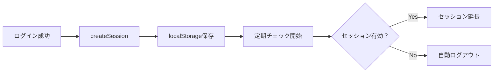

# Rephrase認証システム設計仕様書 v2.0

**更新日**: 2025年8月3日  
**バージョン**: 2.0（securityUtils依存削除版）  
**対象**: Rephraseトレーニングシステム

## 📋 変更履歴

| バージョン | 日付 | 変更内容 |
|----------|------|----------|
| 1.0 | 2025年7月 | 初版作成（securityUtils依存版） |
| 2.0 | 2025年8月3日 | securityUtils依存削除、認証ループ問題解決 |

## 🎯 システム概要

Rephraseトレーニングシステムにおけるユーザー認証とセッション管理を提供するシステム。
v2.0では複雑な依存関係を削除し、シンプルで安定した認証機能を実現。

### 主要な改善点（v2.0）
- ✅ securityUtils依存の完全削除
- ✅ 認証ループ問題の根本解決
- ✅ 直接的なlocalStorage操作によるシンプル化
- ✅ セキュリティレベルの維持

## 🏗️ システム構成

### コンポーネント構成
```
training/
├── index.html           # メインUI（認証必須）
├── auth.html           # 認証フォーム
├── auth-check.html     # 認証チェック中継ページ
├── js/
│   ├── auth.js         # 認証システム本体（v2.0）
│   └── security.js     # セキュリティユーティリティ
└── matrix/
    └── index.html      # トレーニング開始ページ
```

## 🔐 認証フロー

### 1. アクセス制御フロー
```mermaid
graph TD
    A[ユーザーアクセス] --> B{認証システム<br/>読み込み済み？}
    B -->|No| C[100ms待機後再試行]
    C --> B
    B -->|Yes| D{isAuthenticatedUser()}
    D -->|認証済み| E[トレーニングUI表示]
    D -->|未認証| F[auth-check.htmlへリダイレクト]
    F --> G[認証ページ表示]
    G --> H[ログイン処理]
    H --> I[成功時index.htmlへ]
```

### 2. セッション管理フロー


## 🔧 技術仕様

### AuthSystemクラス（v2.0）

#### 主要メソッド

##### `isLoggedIn()` - ログイン状態確認（v2.0改良版）
```javascript
isLoggedIn() {
    // シンプルな認証チェック
    if (!this.currentUser) return false;
    
    // 直接localStorage確認
    const sessionData = localStorage.getItem('userSession');
    if (!sessionData) return false;
    
    const session = JSON.parse(sessionData);
    if (session.expires <= Date.now()) {
        this.clearSession();
        return false;
    }
    
    return true;
}
```

##### `createSession(user)` - セッション作成（v2.0改良版）
```javascript
createSession(user) {
    const sessionData = {
        username: user.username,
        created: Date.now(),
        expires: Date.now() + this.sessionTimeout
    };
    
    // 直接localStorage保存
    localStorage.setItem('userSession', JSON.stringify(sessionData));
}
```

##### `clearSession()` - セッションクリア（v2.0改良版）
```javascript
clearSession() {
    // 複雑な依存関係なしで確実にクリア
    localStorage.removeItem('userSession');
    localStorage.removeItem('rephrase_session');
    this.currentUser = null;
}
```

##### `restoreSession()` - セッション復元（v2.0改良版）
```javascript
async restoreSession() {
    const sessionData = localStorage.getItem('userSession');
    
    if (sessionData) {
        const session = JSON.parse(sessionData);
        
        if (session.expires > Date.now()) {
            const user = this.getUser(session.username);
            if (user && user.isActive) {
                this.currentUser = user;
                this.extendSession();
                return true;
            }
        }
    }
    
    this.clearSession();
    return false;
}
```

### セキュリティ仕様

#### パスワード暗号化
- **HTTPS環境**: crypto.subtle（SHA-256）
- **HTTP環境**: フォールバック簡易ハッシュ
- **ソルト**: 16バイト暗号学的安全乱数

#### セッション管理
- **有効期限**: 24時間
- **チェック間隔**: 1分ごと
- **保存場所**: localStorage（暗号化なし、v2.0でシンプル化）

#### レート制限
- **ログイン**: 最大5回試行、15分ロックアウト
- **登録**: レート制限対応

## 🚫 アクセス制御

### 直接URL制御
```javascript
// training/index.html認証チェック
function waitForAuth() {
    if (window.authSystem && window.securityUtils) {
        if (isAuthenticatedUser()) {
            // 認証済み - UI表示
            return;
        } else {
            // 未認証 - リダイレクト
            window.location.href = 'auth-check.html';
            return;
        }
    } else {
        setTimeout(waitForAuth, 100);
    }
}
```

### ページ間ナビゲーション
1. **matrix/index.html** → `../auth-check.html`
2. **explanation/index.html** → `../auth-check.html`
3. **auth-check.html** → 認証状態確認後適切にルーティング
4. **auth.html** → ログイン成功後`index.html`

## 📊 データ構造

### ユーザーデータ
```javascript
{
    id: "user_12345",
    username: "user123",
    email: "user@example.com",
    passwordHash: "hashed_password",
    salt: "random_salt",
    createdAt: "2025-08-03T00:00:00.000Z",
    lastLogin: "2025-08-03T12:00:00.000Z",
    loginAttempts: 0,
    lockedUntil: null,
    isActive: true
}
```

### セッションデータ（v2.0簡素化）
```javascript
{
    username: "user123",
    created: 1722672000000,
    expires: 1722758400000
}
```

## 🛡️ セキュリティ対策

### 実装済み対策
1. **パスワードハッシュ化**: ソルト付きハッシュ
2. **セッション管理**: 有効期限付きトークン
3. **レート制限**: ブルートフォース攻撃対策
4. **アカウントロック**: 不正ログイン試行対策
5. **直接アクセス防止**: 認証なしでのURL直接アクセス不可

### HTTP環境対応
- Live Server等のHTTP環境で動作
- crypto.subtle利用不可時のフォールバック
- セキュリティレベル維持

## 🔄 認証フロー詳細

### 初回アクセス
1. `training/index.html`アクセス
2. 認証システム読み込み待機
3. `isAuthenticatedUser()`チェック
4. 未認証 → `auth-check.html`リダイレクト
5. `auth-check.html`で認証状態再確認
6. 未認証 → `auth.html`表示

### ログイン処理
1. `auth.html`でログインフォーム表示
2. 認証情報送信
3. パスワード照合
4. 成功時セッション作成
5. `index.html`リダイレクト

### 認証後アクセス
1. `training/index.html`アクセス
2. セッション確認
3. 有効 → UI表示
4. 無効 → 認証フローへ

## ⚠️ 制限事項

### v2.0での変更点
- **securityUtils依存削除**: 複雑な暗号化機能を削除
- **localStorage直接操作**: セキュリティユーティリティを経由せず直接操作
- **エラーハンドリング簡素化**: 基本的なtry-catch構造

### セキュリティ考慮事項
- HTTP環境では暗号化機能に制限
- 本番環境ではHTTPS推奨
- ローカルストレージの制限（ドメイン内アクセス可能）

## 🧪 テスト項目

### 機能テスト
- [ ] 新規ユーザー登録
- [ ] ログイン・ログアウト
- [ ] セッション自動延長
- [ ] セッション期限切れ処理
- [ ] 直接URL アクセス防止

### セキュリティテスト
- [ ] パスワード暗号化確認
- [ ] レート制限動作確認
- [ ] アカウントロック機能
- [ ] セッションハイジャック対策

### 互換性テスト
- [ ] HTTP環境動作確認
- [ ] HTTPS環境動作確認
- [ ] 複数ブラウザ対応
- [ ] モバイルデバイス対応

## 📝 運用ガイド

### デプロイ時チェックリスト
1. [ ] 認証フラグ確認（`SKIP_AUTH_FOR_DEVELOPMENT = false`）
2. [ ] HTTPS設定確認
3. [ ] セッションタイムアウト設定確認
4. [ ] エラーログ設定確認

### トラブルシューティング
- **認証ループ**: sessionStorage/localStorage確認
- **ログイン失敗**: コンソールログ確認
- **セッション切れ**: タイムアウト設定確認

## 🚀 今後の改善予定

### セキュリティ強化
- [ ] JWT認証導入検討
- [ ] 多要素認証対応
- [ ] サーバーサイド認証連携

### UX改善
- [ ] ログイン状態視覚化
- [ ] 自動ログイン機能
- [ ] ゲストモード追加

---

**設計責任者**: Rephrase開発チーム  
**技術スタック**: JavaScript ES6+, Web Crypto API, localStorage  
**対応ブラウザ**: Chrome, Firefox, Safari, Edge（モダンブラウザ）
